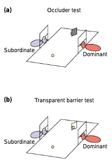
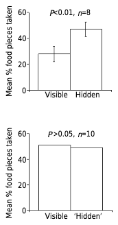
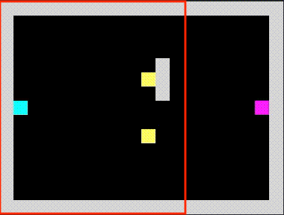
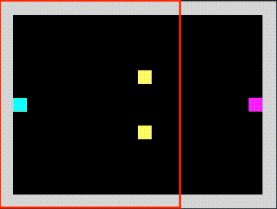
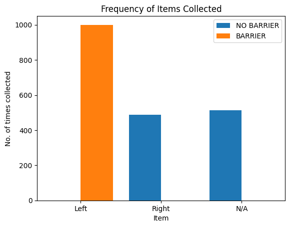
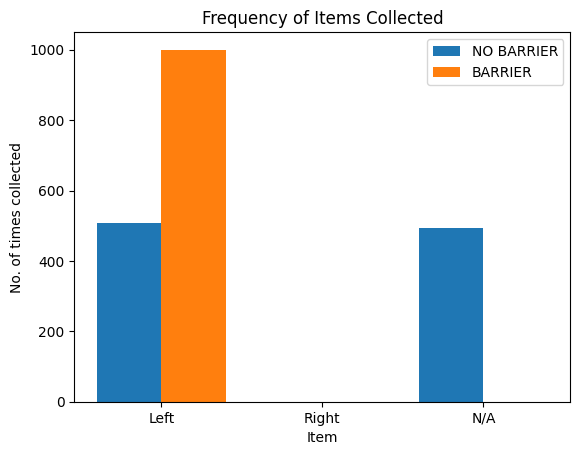
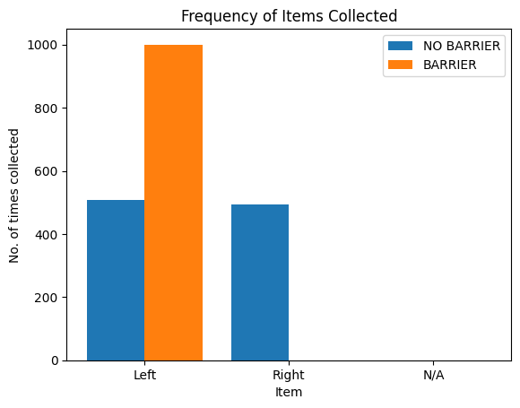
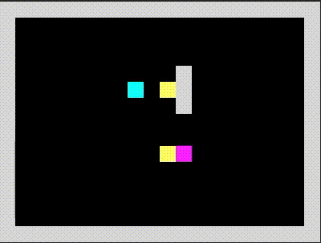

# chimp-ai-nzee

:monkey_face: Recreation of Theory of Mind experiment done on chimpanzees as an RL environment

## Overview

In this project we recreated the Theory of Mind experiment, done on chimpanzees in 2001 by Joseph Call, as an RL environment. And we asked the question: can an RL agent learn how to behave like the _subordinate_ chimpanzee in the experiment?

### Experiment Setup

  

As seen in the figure above, the experiment consists of two settings. In the first one (barrier test), two food items are placed at the center of a room with one hidden from the dominant's field of view. The subordinate and dominant chimpanzees are then released to reach for the food. In the second one (no barrier test), the same food items are placed in the room but both are visible by the two chimpanzees.

What the author of the paper evaluated was the cognitive ability of the _subordinate_ chimpanzee of recognizing when to reach which food item (left or right). Because the dominant chimpanzee has "priority" over the subordinate with respect to food, it was imperative for the subordinate to choose appropriately.

After running this experiment with different subjects, Call observed the following:

  

- In the barrier test, the subordinate chose the hidden food significantly more times.
- In the no barrier test, the subordinate chose either food with roughly the same frequency, based on which one the dominant chose in the first place.

By observing this, they concluded that chimpanzees do exhibit some Theory of Mind since the subordinate was able to reason about what the dominant could or could not see, i.e. what the dominant knew or did not know about the locations of food.

### RL Environment

To translate this experiment to RL, we formulated the problem as a 15 x 20 grid board with two different versions: the barrier and no barrier tests. The dominant chimpanzee was modeled as being part of the environment. It follows a deterministic heuristic based on the setting. For the barrier test, it always reaches for the right item (not hidden). For the no barrier test, it reaches for either the left or right item at random with equal probability. This behavior matches what was observed in the original experiment.

The subordinate chimpanzee is the RL agent that will attempt to learn a policy that models the behavior of its real-life counterpart. It receives a cropped RGB image (15 x 15) of the board as observation. This mimics the field-of-view of the subject inside the room. And it outputs one of five possible movement actions: `UP`, `DOWN`, `LEFT`, `RIGHT` and `STAY`.

Both subjects start on each side of the board, and the episode terminates when the subordinate agent reaches an item. If the agent reaches an item that the dominant did not reach as well, it receives a final reward of `1.0`. On the other hand, if it reaches the same item then its reward is `-1.0`. At every step, it also receives a `-0.1` reward from the environment.

The following figures show the environment in its two settings: barrier (left) and no barrier (right). The red square denotes the field of view of the subordinate agent. The environment was implemented as a custom Gym environment using Pycolab internally.

  
  

## Experiments

### PPO All Settings

We started by training and evaluating a standard PPO agent, with a CNN-based policy, on the two experiment settings _at the same time_. The setting, barrier or no barrier, that was presented to the agent was randomly chosen on every reset. The figure below shows the frequency of items collected by the agent during the evaluation period.

  

From the plot, we can observe that the agent was able to solve the **barrier** setting by successfully choosing the _left_ item (the one **hidden**) all the time since the dominant cannot get to it. However, it was _not_ able to solve the **no barrier** setting. We expected the agent to collect the right and left items ~50% of the time each (based on where the dominant went), just like in the real-life experiment. From the plot, we can observe that the agent always goes for the _right_ item. Since the dominant's heuristic is to reach for either the left or right items ~50% of the time, the subordinate agent is only able to successfully collect the right item ~50% of the time.

### PPO Barrier Setting

Our second experiment consisted of training the same PPO agent _only_ on the **barrier** setting, and evaluating it against _both_ settings. The results of this experiment are shown below.

  

As we can see, the results are similar to the ones from the first experiment. The agent was able to solve the **barrier** setting (successfully reaching the left or hidden item), but it was _not_ able to solve the **no barrier** setting. These results are not necessarily surprising since the agent was only exposed to the setting that contained the barrier in its input observations. This biased the agent to always choose the left item. Which, of course, when placed in the no barrier setting caused the agent to successfully retrieved that item only 50% of the time.

### PPO No Barrier Setting

For our third experiment, we did the opposite of the previous one. We trained the PPO agent _only_ on the **no barrier** setting, and evaluated it on both settings. Once again, the figure below shows the results.

  

This time we can see that the agent was able to solve both the **barrier** and **no barrier** settings! Surprisingly, by solely training on the no barrier setting, the agent learned how to _read_ the dominant's movements in order to choose the best item to reach for. We can clearly see this reflected in the plot. In the barrier setting, the agent always picks the left item. In the no barrier one, it picks each item with equal probability. This implies that the agent takes into account the _direction_ where the dominant is heading to make its decision. To showcase the agent's learned policy, the two figures below demo the agent acting in the two settings.

  
  

In particular, observe how the agent (blue) waits and reads the movements of the dominant (pink) before choosing where to go. In the case of the barrier setting (left), it is always the left. But, in the other setting (right), it's sometimes left and sometimes right. This behavior matches the one observed in real chimpanzees!

## Conclusions

In this project we were able to develop an agent that learned to behave like the subordinate chimpanzee in the real-life experiment done by Joseph Call in 2001. This naturally leads to the question: is this agent exhibiting some sort of Theory of Mind? The answer is no. Although it exhibits the intended behavior, the mechanisms that it uses cannot be considered a primitive ToM ability. Nevertheless, it was very interesting to see how the agent learned how to read the movement of the other subject in order to make its decisions.

## Appendix

## Model Architecture

The agent was implemented using StableBaselines-3. It uses a CNN-based policy with a custom feature extractor, and the standard layer that maps features to actions as described [here](https://stable-baselines3.readthedocs.io/en/master/guide/custom_policy.html). The architecture of the feature extractor is as follows:

- A `conv2d` layer
  - 3 input channels
  - 32 3 x 3 kernels
  - stride of 1
  - padding of 0
  - ReLU activation
- A `linear` layer
  - 128 output neurons
  - ReLU activation

## Hyperparameters

We used the default PPO hyperparameters for training as described [here](https://stable-baselines3.readthedocs.io/en/master/modules/ppo.html#stable_baselines3.ppo.PPO).

### Reproducing Results

To reproduce the results presented here, run the corresponding command(s).

> **Note:** Make sure to install all dependencies first by running `poetry install`.

- PPO All Settings
  - `python train.py -a PPO -m PPO_all -t 100000`
  - `python eval.py -a PPO -m PPO_all -e 1000`
- PPO Barrier Setting
  - `python train.py -a PPO -m PPO_barrier -t 100000 --setting 1`
  - `python eval.py -a PPO -m PPO_barrier -e 1000`
- PPO No Barrier Setting
  - `python train.py -a PPO -m PPO_no_barrier -t 100000 --setting 0`
  - `python eval.py -a PPO -m PPO_no_barrier -e 1000`
  - `python demo.py -a PPO -m PPO_no_barrier -e 2 --setting 0 --save-gif`
  - `python demo.py -a PPO -m PPO_no_barrier -e 1 --setting 1 --save-gif`

## References

- Call, J. [_Chimpanzee Social Cognition_](https://www.researchgate.net/publication/48182381_Chimpanzee_Social_Cognition), 2001.
